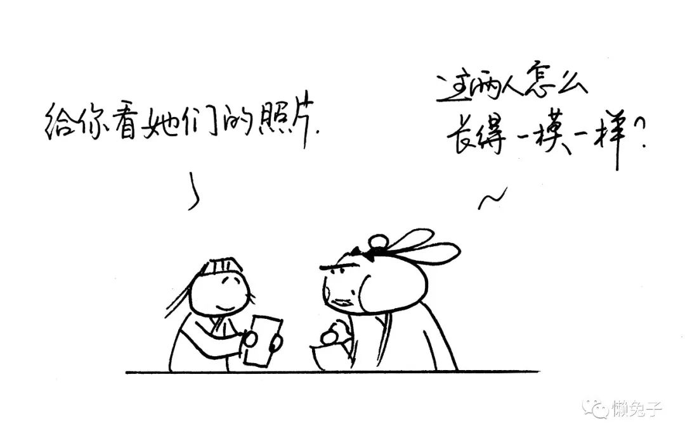
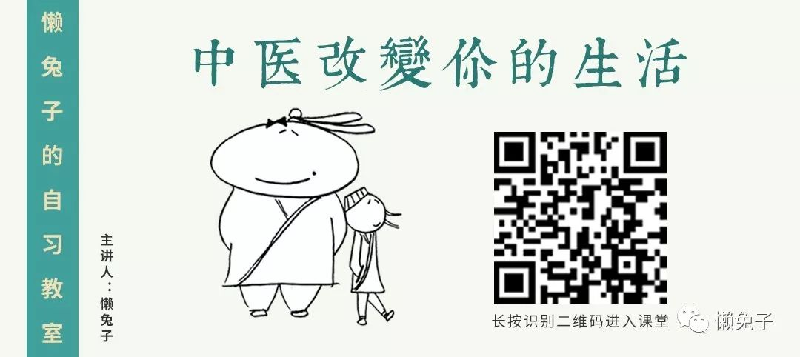

# 医案-介绍两个好用的皮肤病中成药.md

原创： 读者和懒兔子 懒兔子

> 声明：所有医案均来自邮箱读者投稿。请投稿人对稿件内容的合法权益承担相应的法律责任，避免版权纠纷。敬请谅解与配合，谢谢。

医案一：

你好！兔子。说说关于我两岁小孩出荨麻疹并痊愈的经过。

我平时都给小孩买酸奶喝，夏天天气炎热，就更趋向冰箱里的酸奶了。上星期六我带小孩到新家去看布置，惯例又给她买了一瓶酸奶和芝士烘焙面包做下午茶。到家里吃了一点后，她自己跑来跑去玩。不一会就粘人了，不肯自己一个人玩了。

我抱起她一看，手臂和腿上皮肤都有泛红色一块块的，我猛一惊，就想到看身上的皮肤，发现前面和后背也有大小不一的皮肤红块。于是就到药店买藿香正气水用来给小孩冲凉，看看能否有效。晚上冲完凉后在空调房里小孩一觉睡到大天亮，起床后我发现还是有皮肤红块。

我当时就想到以前在公号里看过的一篇文章《我来交作业了——荨麻疹的辨证与治疗》。发现文中一段症状描述“皮肤上出现瘙痒性风团，发无定处，骤起骤退，退后不留痕迹”，和我孩子的表现很像。我发现她有时用手抓皮肤，就会出现红块，体温有低热，情绪不太好。

我按文中的症状辨证后，认为消风散对症，就马上到药店，店员说有消风止痒颗粒，我想颗粒会比药粉好喂，便买了一盒回家按时喂药，藿香正气水也继续外用。

第二天早上，我觉得小孩情绪好了很多，忽然想到懒兔子曾介绍过午时茶，去年我暑假外出旅游居家必备。就又买来午时茶作为善后处理之用，加上这两天注意小孩的饮食清淡，就这样前后两三天皮肤就好了。真的很感谢这些中医方法。

医案二：

懒兔子，您好！

讲个医案。上个月莫名其妙左脚趾痒，奇痒无比，有水泡，而且奇怪的是总在食指和中指间及附近长，挤破后很多水，水清。可是今天挤完了水泡，明天继续！循环了好几天，真的好难受。

开始自我诊断：舌苔黄厚腻、舌尖及尖头两侧有草莓点，下巴也长痘痘，应该是湿热+血淤。还有一点，从去年年底开始脸上莫名其妙长了很多类似斑点的扁平疣！综上所述，我判断温胆汤最适合我！

于是晚上连续泡了一个星期，后来断断续续泡了第二个星期，可是脚上的水泡根本不见好转，舌苔依旧，这时候还伴随着湿热下注，痒，痒，痒。。。好心累啊！

这时候我也快放弃了，想着自己先是上火，干脆先降降火先吧，于是吃了两三天牛黄解毒片、龙肝泻胆丸，下体倒是不痒了。但脚痒依旧。

这时候突然想起我老爸家里常备的湿毒清！于是我马上到药店买了一盒湿毒清胶囊服下，吃了一天，当天脚趾就不痒了，持续吃了三天，脚趾的水泡都没了，就是自己脱的皮。

隔了一个礼拜，我老公说他要去医院看看，说阴囊以及脚痒。哇塞！怎么跟我症状如此之像！我看了他的舌苔白腻但不黄，眼袋严重，脾虚。我花了两天时间说服他先试试湿毒清有没有效果，再上医院。当然他一开始是反对的，额，反正最后他还是被我说服了吃了两天湿毒清。嘻嘻嘻，他反馈已经不痒了。

现在我还在继续服用湿毒清，因为湿毒清具有养血润肤，祛风止痒的功效。还可用于色素沉着，我理解的是色素沉着就是血瘀。因为我下巴总是长大痘痘，痘痘挤掉了好几天里面都还有硬块。另外脸上的扁平疣也是正在尝试湿毒清+龙胆泻肝丸的结合能不能去掉。

请期待我下次医案。

今天要介绍两个很好用的治疗皮肤病的中成药，消风止痒颗粒和湿毒清胶囊。

消风止痒颗粒：防风、蝉蜕、地骨皮、苍术、亚麻子、当归、地黄、 木通、荆芥、石膏、甘草。

这个药是方剂消风散的中成药。功效为消风清热，除湿止痒。主治丘疹样荨麻疹，也用于湿疹、皮肤瘙痒症。

引起本证的主要原因是风湿或者风热侵袭人体，浸淫血脉后，内不得疏泄，外不得透达，邪气郁在肌肤腠理之间。因此出现皮肤瘙痒、疹出色红，或抓破后渗出津水等现象。

消风止痒颗粒可以疏风、祛湿、养血、清热，是治疗风疹、湿疹的常用中成药。有需要的朋友了解一下，这样就不必麻烦自己配药材了熬汤药了。

另一个方子是湿毒清胶囊。

湿毒清胶囊：地黄，当归，丹参，蝉蜕，苦参，白鲜皮，甘草，黄芩，土茯苓。

功效为养血润燥，祛风止痒。用于血虚风燥所致的瘙痒，症见皮肤干燥、脱屑、瘙痒，伴有抓痕、血痂、色素沉着。

这个方子主要是治疗血虚引起的瘙痒症。

那么再看回第二个医案的原文，作者明明是脚上有水泡，并不是皮肤干燥瘙痒啊，为何用了湿毒清这么管用呢？

那是因为“风胜则痒，痒自风来”，只要有风邪在，就会有痒的症状。湿毒清胶囊虽然有养血润燥的功效，但同时也祛风止痒。而且里面的茯苓利水渗湿，苦参清热燥湿，因此对于风热湿疹也同样有效。

要说区别的话，两个药都是祛风、清热、除湿的，但消风止痒颗粒养血润燥的功效稍弱一些，因此皮肤干燥引起的痒症，湿毒清胶囊更适合。

有些湿疹温胆汤效果很好，是因为没有风邪，温胆汤除湿清热即可。但是若有风热之邪在，温胆汤的效果就不明显了，差就差在了疏风的药上。

好了，再次感谢两位作者的分享，期待收到你们更多的医案，投稿请至3240631414@qq.com（邮箱仅供医案投稿，谢绝问诊，恳请谅解），来稿一经选登即送懒兔子签名的《医学就会》或者懒兔子艾露薇时尚拎包哦（任选一），等你们。

> 想要获得更多治疗感冒、发烧、咳嗽、胃病的讲解, 可以直接订阅我的微课程

