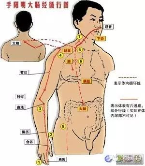
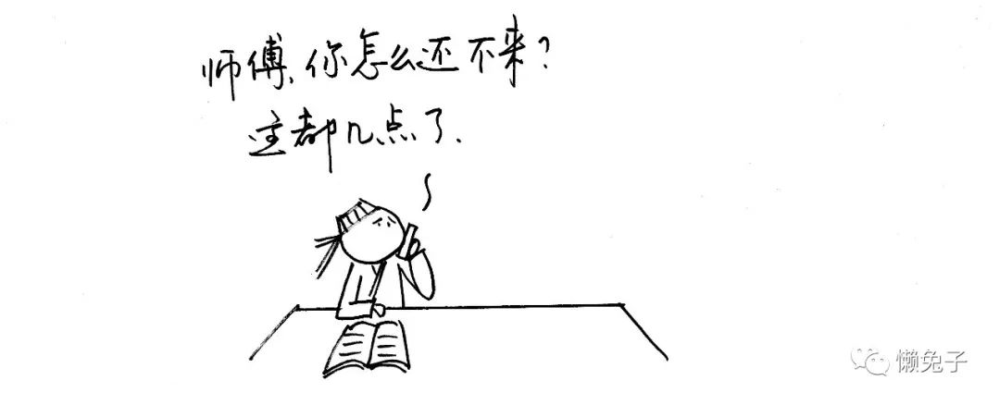
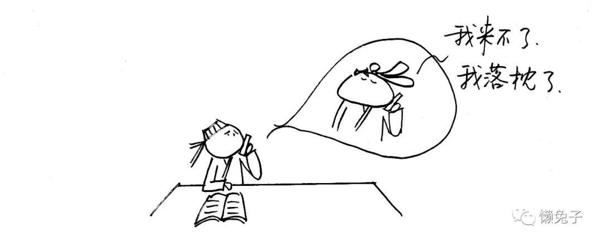
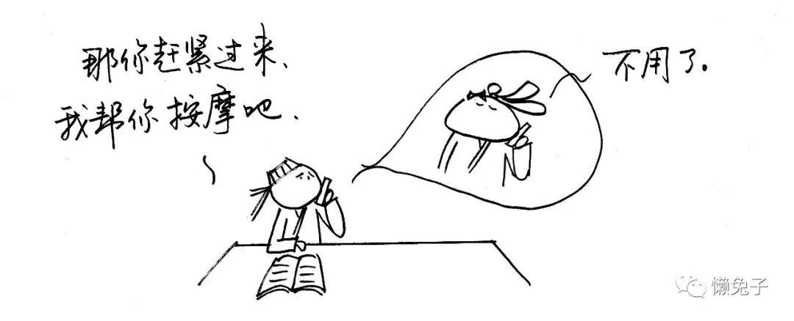
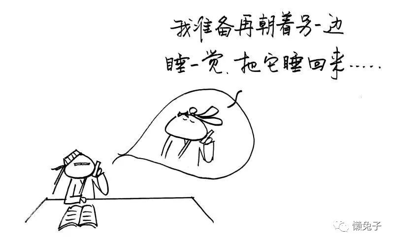

# 医案：自己治好落枕，老神了

原创：读者和懒兔子 懒兔子

> 声明：所有医案均来自邮箱读者投稿。请投稿人对稿件内容的合法权益承担相应的法律责任，避免版权纠纷。敬请谅解与配合，谢谢。

亲爱的兔子，你好！
 
我是位IT工作者，整天对着电脑，可想而知，长期以往，颈椎病就一直光顾着我，烦不胜烦。自从看了你的文章，知道颈椎病可以用“手太阳小肠经”治疗后，这条经就成了我经常按摩的对象，那个效果酸爽啊，哈哈。

然而我今天要说的案例却不是颈椎病，而是另外一个类似的小案例—— “落枕”。

有个周末，躺沙发上玩手机，可能是维持一个姿势的时间有点长了，起身后，脖子转动有点困难，但是还是可以转动的，就没太在意，想想一会应该会好。第二天果然好点了，虽然还有点僵硬，但是没想到第三天、第四天却变得越来越严重，脖子不能转动，连坐车时稍微被颠一下，都是疼痛难忍。

同事看我持续几天都这个状态，还越来越严重，就劝我去医院看看。由于曾经有过因为腰不太舒服去医院被医生野蛮对待的黑历史，我是一点提不起兴趣去医院，同事说我讳疾忌医，这样是要不得的，但是我依然不想去医院，心想去医院我还不如去翻翻兔子呢。

然后，我就搜索到了公号的文章，还真找到了关于落枕的按摩方法，就是按摩“手阳明大肠经”。严格根据兔子的建议，从脖子开始，一边按摩一边转动头，哪疼往哪转，再顺着一直按摩到手指。

持续按摩时间不到10分钟，真的不到10分钟，头可以转动了，疼痛大大减轻。我又坚持按摩了半个小时吧，中午的时候，都跟正常人一样了。

这次真的让我自己也震惊了，也许是颈椎病已经是老顽固了，之前按摩“手太阳小肠经”都没有这么明显的效果。这次落枕也是我有史以来最严重的一次，却没想到自己就搞定了，实在是太开心，省钱省事省心！

然后我把这个事情给家人大大地宣传了一把，希望家人可以一起受益！

经过此次事件之后，对中医的学习热情更上了一层楼，紧跟大家的步伐，勇往直前！

落枕这事儿我专门写过，但是已经好久之前了，所以估计很多新读者都不知道如何治疗，这篇医案来得刚好，正好让新老读者都借着复习一下。

颈椎病用揉膀子的方法可以治疗，那是因为肩颈部分是小肠经经过的地方。经络治病，其中有一个重要的思路，就是任何经络除了治疗本经病以外——只要是在此经络循行经过的地方，出现了酸麻胀痛等症，都可以通过按揉、扎针该条经络进行治疗。

所以颈椎病治疗的关键，就在于小肠经的经络是否通畅，只要将经络揉通，肩颈问题就不是个事儿了。

落枕也是一样。我们先来看看落枕的症状：一般表现为起床后感觉颈后部，上背部疼痛不适，以一侧为多，或有两侧俱痛者，或一侧重，一侧轻。由于疼痛，使颈项活动不利，不能自由旋转，严重者俯仰也有困难，甚至头部强直于异常位置，使头偏向病侧。

那我们再来看看经过脖子两侧的经络：手阳明大肠经。

因此落枕的解决关键就在于大肠经，大肠经通了，落枕就好了。

按揉的方法也是一样，先简单的揉捏一下僵硬的肩颈，做肌肉放松。然后从脖子上的扶突穴（上图中编号为7）开始，一直顺着大肠经往手部按揉。这里有个诀窍：一边按揉，一边要患者不停地转动脖子，怎么疼怎么扭，这样才会见效迅速。

如果我们在按揉的过程中，摸到皮肤下有条索状物，一定要反复揉搓，把条索揉开。条索其实就是气血的结节，经络不通的产物，等条索没有了，经络也就畅通了。

落枕这些小病，真的就别去医院麻烦医生了，自己搞定不是问题。

再次感谢作者的分享，期待收到你们更多的医案，投稿请至3240631414@qq.com（邮箱仅供医案投稿，谢绝问诊，恳请谅解），来稿一经选登即送懒兔子签名的《医目了然》或者懒兔子芭宝丽围裙哦（任选一），等你们。

> 想要获得更多治疗感冒、发烧、咳嗽、胃病的讲解, 可以直接订阅我的微课程

