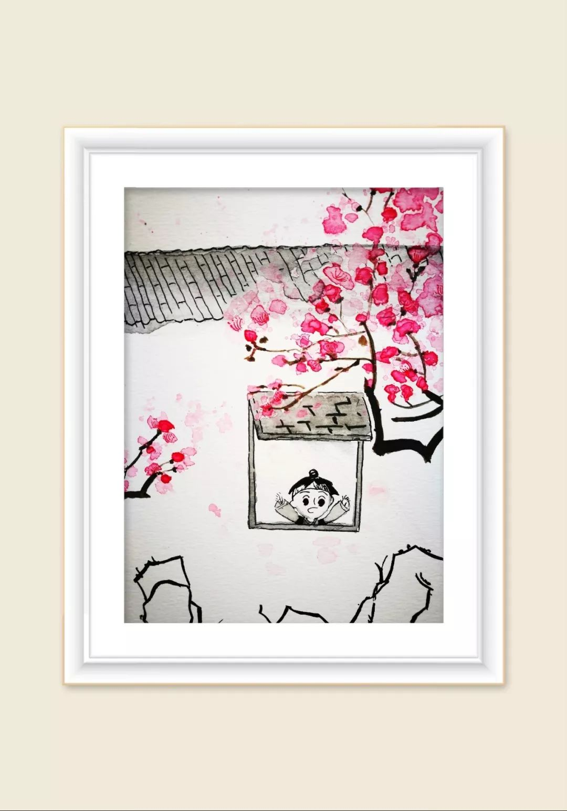
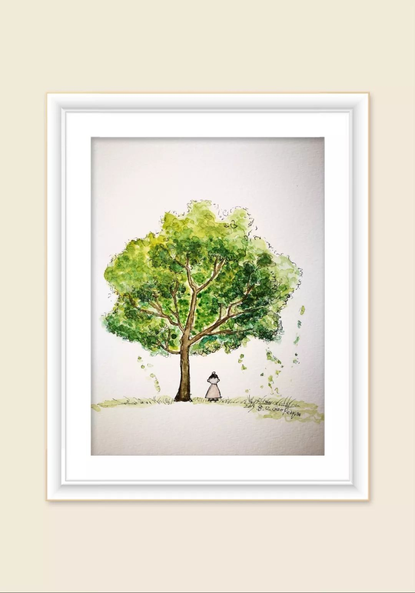
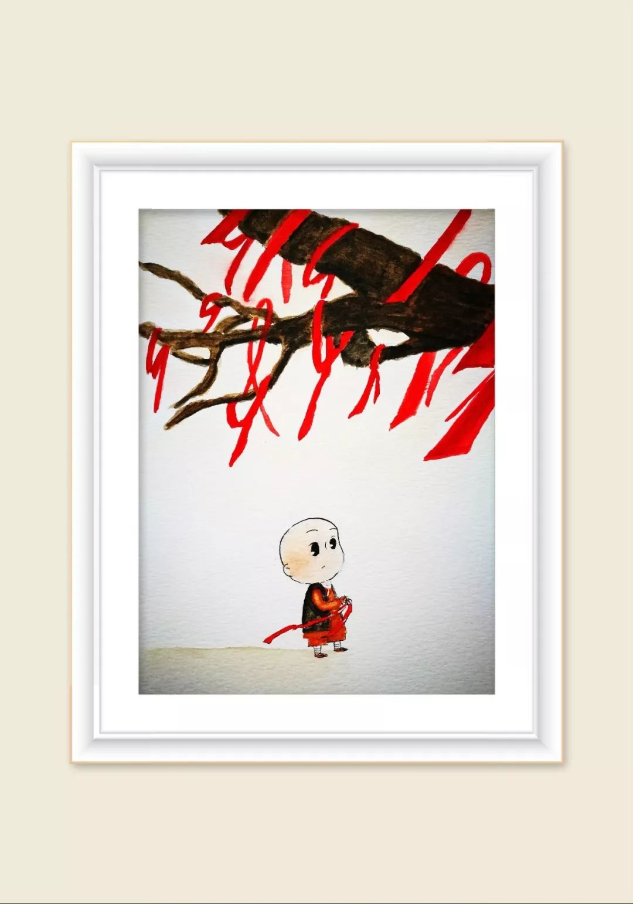
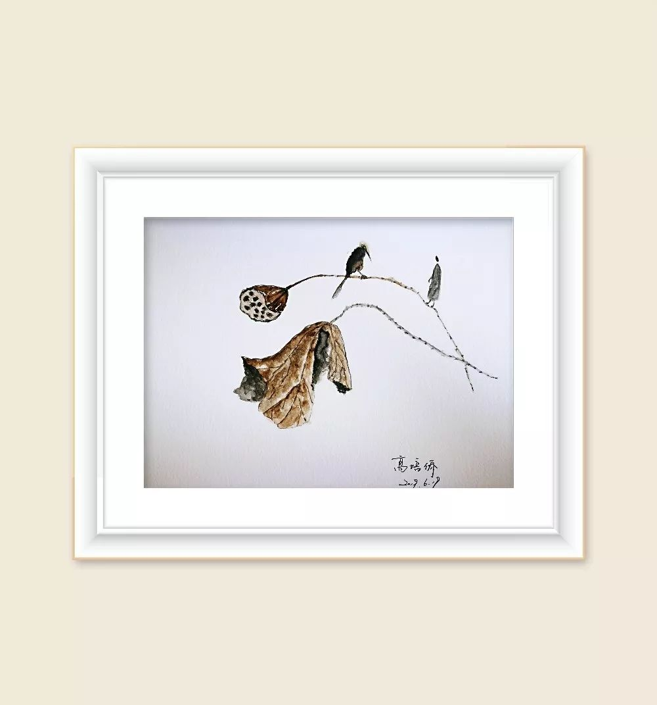

# 肩周炎颈椎病妙方来了，办公室一族、低头族、人到中年必须要收藏哦

原创：文泉杰 文小叔说

文小叔说  让中医更美更有趣更贴近生活

今天，小叔想送一个妙方给三类人，第一类人是办公室一族，因为他们经常伏案工作，对颈椎与肩膀会造成的伤害是一点一滴的，日积月累的，最终会爆发成颈肩综合征。
 
还有一类人就是低头族，沉迷于手机的人，同样会对颈椎与肩膀造成很大的伤害。
 
最后一类人就是中年人，过了五十岁的中年人，最容易得颈肩综合征，老百姓俗称“五十肩”，这是因为人过了五十，正气不足了，气血不足了，外邪容易侵犯体表，风寒湿加上瘀血容易堆积在肩周这一块，因为这一块是最不容易活动到的。
 
小伙伴们应该听过一个成语叫做“病入膏肓”，膏肓是一个穴位，这个穴位就在肩膀下面。
 
颈肩综合征表现就是脖子与肩膀周围一圈各种不适，酸麻胀，发紧，发冷，最严重的症状就是痛，严重时不能动，肩膀都抬不起来，很多人是痛得不得了时才去看医生的。这个时候稍稍有些晚了，治疗起来也麻烦一些。如果稍微出现一些不适就用中医的方法调理，就会把颈肩综合征扼杀在萌芽状态之中。
 

小叔为你们精心打造了一个方子，叫做颈肩灵：
 
    麻黄10克桂枝12克
    独活6克羌活6克防风6克
    苍术12克甘草9克大枣12枚
    当归12克川芎12克乳香12克没药12克
    葛根50克
 
接下来，跟随小叔分析一下这个方子，同时学一下颈肩综合征的调理方法。
 
如果从病位来说，颈肩综合征属于表证还是半表半里还是里证？
 
毫无疑问颈肩综合征属于表证，因为颈椎与肩膀周围属于皮肤，属于肌肉，这些都属于体表。体表的症状一般是由什么引发的呢？不是内伤，是外邪。我们可以想象一下，我们最容易得表证的时候是什么时候？就是感冒的时候。感冒的时候，我们全身的症状刚开始都是表证，头痛啊流鼻涕啊打喷嚏啊背痛啊腰痛啊等等，都是表证。
 
到底是什么邪气侵犯了我们的体表呢？不外乎三种，一种是风邪，一种是寒邪，一种是湿邪，久病必瘀，最后加上一种瘀血。
 
颈肩综合征不是感冒，但是我们一定要明白它所表现出来的症状与风寒感冒类似，所以我们可以把颈肩综合征当做慢性感冒来治疗，当做表证来治疗。如何治疗呢？把四种邪气从颈肩赶跑就可以了。

第一种外邪，也是侵犯颈椎与肩膀最厉害最顽固的外邪，就是寒邪。很多人脖子与肩周天气稍微一凉就感觉发冷，甚至夏天睡觉都必须穿一个秋衣，这就是寒邪的表现。
 
所以第一组药小叔毫不犹豫地请来了麻黄与桂枝两兄弟帮忙，麻黄与桂枝组合是驱寒最好的一对药，麻黄辛温解表，如针孔一样，可以把细小的毛孔打开。桂枝也是温热药，桂树最顶端的枝头，吸收了最炽烈的阳气，桂枝阳气爆棚，可以打通体表的经络，把阳气源源不断输入体表，把体表的寒邪全部赶跑。
 
桂枝与麻黄一组合就会让你的肩膀出一点细细的汗，出汗就说明表解了，表痛了，经络通了，寒湿被排出来了，让你感觉非常舒服通透。麻黄走气分，桂枝走血分，麻黄与桂枝把你的气血通道都打开了。桂枝还能够解肌，能够把肌肉层面的寒气逼出来。

第二组药，主要是针对体表的第二种邪气的，就是风邪。小叔用了祛风三药，独活、羌活、防风。
 
很多人的肩膀脖子特别怕风，风一吹就受不了，颈椎病肩周炎就犯了，坐在空调车里面浑身不舒服，这就是风邪在作怪。
 
独活，可以抵御风邪，这种特殊的草本哪怕是狂风暴雨，它依然如如不动，风吹不倒它。所以中医用它来驱风，独活有一种独立的品格，可以强壮你的下肢，独活药性主要走下半身，可以把下半身的风湿祛除。
 
有独活就会有羌活，与独活一样特别能够抵御西北凌冽的寒风，羌活如西域羌族一样勇猛刚烈温燥。羌活祛风善于走上半身，善于走上肢。独活与羌活一般一起用，这样就可以搞定全身上下的风湿，风邪是无孔不入的，有了独活与羌活，等于给身体加了一层密不透风的防护网。
 
最后再加一点防风，防风是直接把风挡在外面。
 
独活与羌活加上防风还可以打击湿邪，因为风胜湿，风来了，湿气就容易散掉。风药善于走动，搜风的同时也可以把湿气搜刮干净。
 
毕竟独活与羌活防风不是专门祛湿的，所以针对颈椎肩周第三种邪气湿邪，我们还需要专门的药来代替，小叔这里用了苍术。

有小伙伴们问了，小叔，你不是说白术是祛湿圣药吗？为什么不用白术呢？白术与苍术有什么区别呢？
 
是这样的，白术祛湿主要是通过健脾来祛湿的，白术偏补，药性主要走脾胃，无法走到体表。而这里需要驱赶外邪，需要把体表的湿气去掉，所以只能用气味雄烈芳香燥烈的苍术来解表化湿。苍术的药性是可以走到体表的，医圣张仲景就喜欢用苍术来治疗风湿。
 
苍术与白术的区别就是，苍术是大哥，白术是小弟，苍术偏于驱邪，白术偏于守中。苍术祛湿健脾，白术健脾祛湿。苍术是乔峰，白术是段誉。
 
风寒湿搞定了，最后一步就是要搞定瘀血。只有瘀血才会让你痛。久病必瘀，冰冻三尺非一日之寒，很多人的颈肩综合征都是日积月累而成，任何一种病，只要病程很长一定会造成气血瘀滞。
 
另外，颈肩综合征属于风湿范畴，会治风湿的高手一定不会忘记活血化瘀。因为寒邪会导致瘀血，血脉遇寒就会凝滞，就好比冬天的河流会结冰一样。湿邪也会阻碍气血的运行，造成瘀血。
 
不通则痛，颈肩综合征最严重的一个症状痛，就说明身体有瘀血了。
 
所以小叔直接请来川芎来搞定瘀血，川芎是血中气药，善于走窜，特别活泼好动，可以上行头面，下行血海，血海就是女人的子宫，还可以旁开郁结。解决瘀血特别需要川芎这种活泼的药。
 
然后再配合当归扶正，川芎解决了瘀血，当归把血补足，让新血去占领这个地方，不然以后瘀血还会卷土重来。一切不通的背后就是不荣，如果你气血充盈，血脉肯定会通畅，血脉通畅怎么会淤堵呢？血脉畅通，任何风寒湿都进不来。

为什么要加上乳香没药呢？这两味药主要是治标的，主要是止痛的。颈肩综合征发作起来不是很痛嘛，乳香没药可以活血止痛，可以行气止痛，搞定一切气滞血瘀导致的疼痛，效果杠杠的。
 
最后小叔还重用了葛根，为什么呢？因为葛根可以把药性往上一提，提到颈椎，提到肩周。医圣张仲景说，项背强几几，就可以用葛根。项背强几几，就是我们的肩膀后背发紧的状态，说白了就是肩周炎。葛根除了可以升提药性，还可以解肌，让你的肌肉松弛舒缓。
 
为了防止这个方子伤阴，小叔加入大枣甘草来调和一下，也可以让味道更好喝一点。
 
好啦，这就是文小叔为小伙伴们打造的颈肩灵，有四种服用方法：
 
第一种，脾胃很好的人，直接服用汤药，一天一剂，服用二十一天。
 
第二种，脾胃不好的人，可以用这个方子泡脚，但效果要差很多。
 
第三种，把这个方子打成粉，用沙袋装好，加热，趁热敷在颈椎肩周部位。
 
第四种，可以喝酒的男人，用这个方子来泡酒，要用高度白酒来泡，一剂药用一斤酒，泡上三个月。然后每天早起喝20毫升左右，喝完以后赶紧再用这个药酒涂擦患处。
 
温馨提醒，毕竟这个方子比较温燥，如果喝了上火口渴，可以用酸梅汤来缓解，银耳羹也可以。
 
最后祝小伙伴们的脖子肩膀像天鹅一样活动自如哦。

特别提醒：美好的一天开始啦，喜欢文章的话别忘记点击文章右下角“在看”两个字或者分享朋友圈哦。小叔另外一个公众号——『文小叔说历史』，大家微信搜索关注一下。由于精力能力有限，微信规定只能入选100条，留言不能全部回复，请原谅小叔。
福利来啦：打开公众号对话框输入“月经不调”“感冒”“脱发”“手脚冰凉”“胃痛”“肝气不舒”“伤精”“上热下寒”“脾胃”“失眠”“祛湿”“气血”“减肥”“便秘”“腹泻”“肾虚”“祛痘”“咳嗽”“鼻炎”“颈椎”“抑郁”获取相应调理方。

